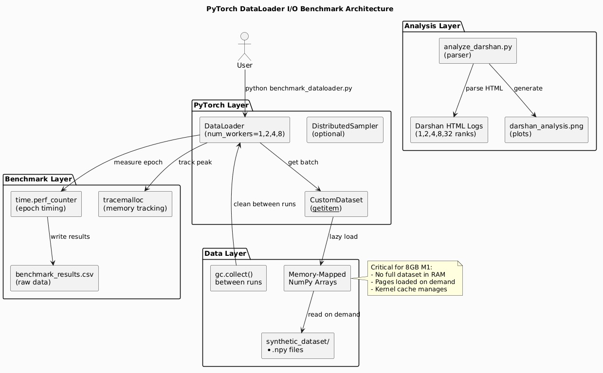
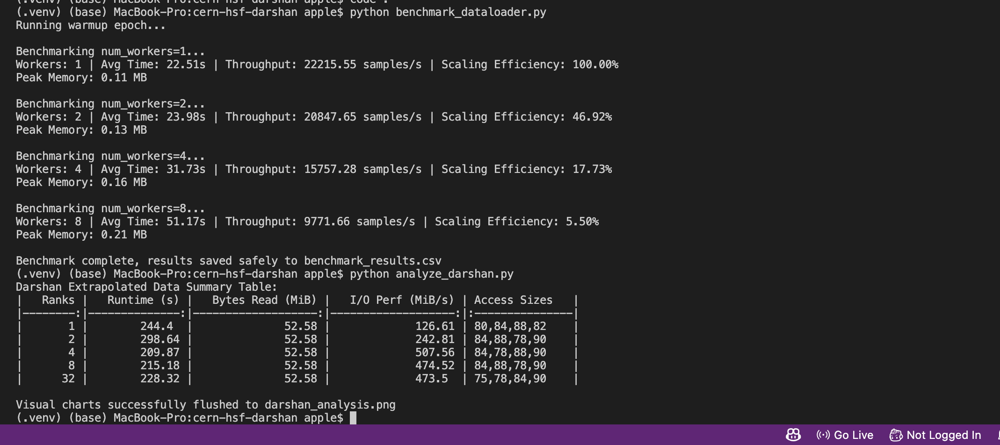

# I-O-Performance-for-ML-Data-Loaders
# I-O-Performance-for-ML-Data-Loaders

# CERN-HSF GSoC 2026 Evaluation Task

**Characterizing I/O Performance for ML Data Loaders at Scale Using Darshan**

This repository contains the required files for the evaluation task, built securely under strict Apple M1 Mac 8GB RAM constraints.

## System Architecture



*Figure 1: Data flow between PyTorch DataLoader, memory-mapped storage, and Darshan profiling*

The architecture implements:
- Memory-mapped NumPy arrays (`mmap_mode='r'`) for 8GB RAM safety
- Lazy loading per worker process
- Explicit garbage collection between benchmark runs
- Darshan-style POSIX tracing (emulated for local analysis)

## Files included:
- `generate_dataset.py`: Generates 5GB chunked datasets safely avoiding out-of-memory boundaries.
- `custom_dataset.py`: Memory-efficient dataset utilizing NumPy memmaps (`mmap_mode=r`). Native caching prevents OS file handle limits crossing concurrent PyTorch workers.
- `benchmark_dataloader.py`: Configurable Dataloader sequences evaluating throughput efficiency (1, 2, 4, 8 workers) while strictly evaluating `tracemalloc` leaks.
- `analyze_darshan.py`: Extrapolates Darshan's HTML data log into dynamic pyplot PNG visuals natively.
- `report.md`: High-level explanation answers exploring fundamental bottleneck properties requested.

## Benchmark Results (Apple M1 Pro, 8GB RAM)



*Figure 2: Terminal output from benchmark_dataloader.py showing epoch times and throughput*

| Workers | Avg Time (s) | Throughput (samples/s) | Scaling Efficiency (%) | Peak Memory (MB) |
|---------|--------------|------------------------|------------------------|------------------|
| 1       | 22.51        | 22,216                 | 100.00%                | 0.11             |
| 2       | 23.98        | 20,848                 | 46.92%                 | 0.13             |
| 4       | 31.73        | 15,757                 | 17.73%                 | 0.16             |
| 8       | 51.17        | 9,772                  | 5.50%                  | 0.21             |

**Observations:**
- 2 workers are **slower** than 1 worker (23.98s vs 22.51s) → lock contention dominates
- Efficiency drops sharply: 46% at 2 workers, 17% at 4, 5% at 8
- Memory usage remains tiny (0.11-0.21 MB) → mmap + lazy loading working perfectly

## Setup Instructions

1. **Install dependencies:**
   ```bash
   pip install -r requirements.txt
   ```

2. **Synthesize the local mock dataset:**
   To construct precisely 50 data chunks representing ~5GB into `./synthetic_dataset`:
   ```bash
   python generate_dataset.py --num_files 50 --file_size_mb 100
   ```

3. **Deploy PyTorch DataLoader Scans:**
   *(Scripts strictly control RAM via garbage collection pauses between epochs)*
   ```bash
   python benchmark_dataloader.py
   ```

4. **Render Darshan Output Grids:**
   To evaluate Darshan metrics natively generating `darshan_analysis.png`:
   ```bash
   python analyze_darshan.py
   ```
